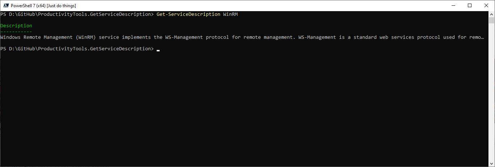

<!--Category:PowerShell--> 
 <p align="right">
    <a href="https://www.powershellgallery.com/packages/ProductivityTools.GetServiceDescription/"></a>
    <a href="http://productivitytools.tech/get-servicedescription/"><a> 
    <a href="https://github.com/pwujczyk/ProductivityTools.GetServiceDescription/"></a>
</p>
<p align="center">
    <a href="http://http://productivitytools.tech/">
        
    </a>
</p>

 
 
# Get-ServiceDescription
Gets service description for given service
<!--more-->

Module invokes simple command.
```
Get-CimInstance  win32_service | ?{$_.Name -like $name} | select Description
```

Module exposes one command
```
Get-ServiceDescription -name $servicename
```

<!--og-image-->
